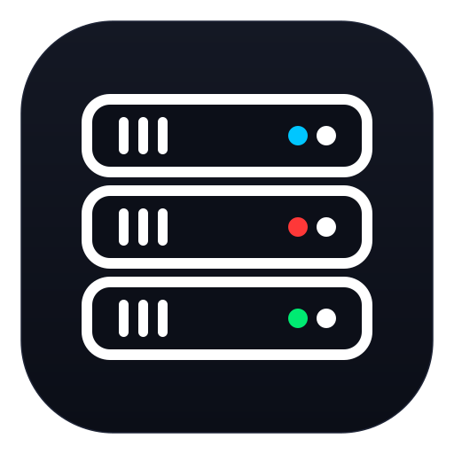
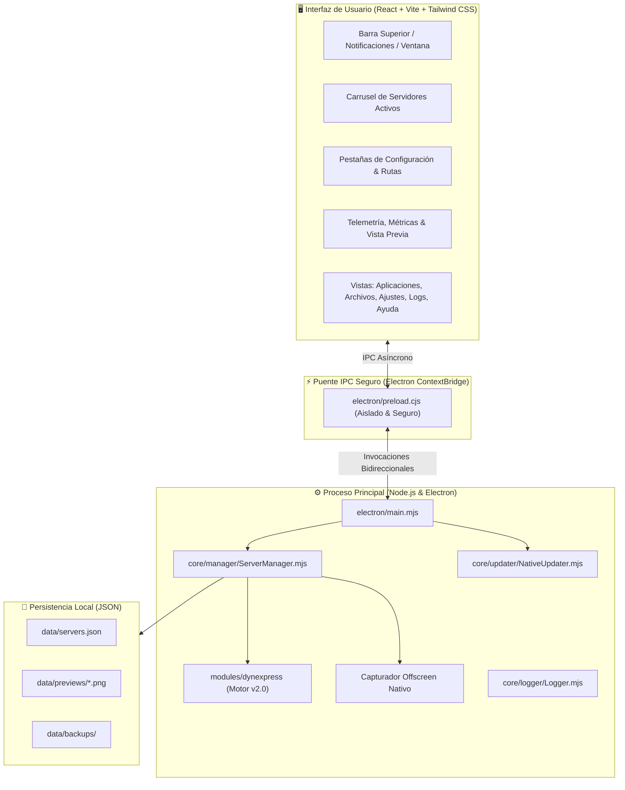

# ⚡ KYRNEX — Local Web Applications Runtime & Manager Platform

<p align="center">
  
</p>

<p align="center">
  <strong>El entorno de escritorio definitivo para orquestar, ejecutar y monitorear múltiples servidores Express y aplicaciones web locales con telemetría en tiempo real, previsualización en caliente y cero fricción.</strong>
</p>

<p align="center">
  <a href="https://github.com/devlwte/kyrnex/releases/latest"></a>
  <a href="https://github.com/devlwte/kyrnex/blob/main/LICENSE"></a>
  
  
  
  
</p>

---

## 💡 ¿Por qué Kyrnex?

Si eres desarrollador, diseñador web o creador de contenido, seguro conoces este escenario:
- Tienes múltiples terminales abiertas corriendo `node server.js`, `npx serve` o scripts en segundo plano.
- Los puertos colisionan constantemente (`EADDRINUSE: port 3000 already in use`).
- No recuerdas qué ruta pertenece a qué proyecto ni cómo se veían las páginas sin abrirlas una a una en el navegador.
- Quieres compartir o ejecutar un proyecto estático o con plantillas sin tener que instalar dependencias complejas en cada máquina.

**Kyrnex nace para resolver esto de raíz.** Es una suite de escritorio nativa que combina un **gestor multiserver inteligente**, un motor dinámico de alto rendimiento (**DynExpress v2.0**), telemetría en vivo, capturas de pantalla automáticas de tus aplicaciones y un sistema de actualización transparente sin intermediarios.

---

## ✨ Características Principales

### 🚀 Orquestación Multiserver Simultánea
- Ejecuta tantos servidores como necesites al mismo tiempo (ej. puerto `3000`, `3050`, `8080`) en entornos completamente aislados.
- **Auto-Port Fallback:** Si un puerto ya está ocupado por otra aplicación de tu sistema, Kyrnex detecta el conflicto y reasigna automáticamente el siguiente puerto libre disponible sin interrumpir tu flujo.
- Arranque selectivo o automático al encender la app (`autoStart`).

### 🧩 Motor DynExpress v2.0 (Powered by KyrnForge)
- Construido sobre Node.js y Express con arquitectura de alta disponibilidad.
- Introspección de rutas en tiempo real (`GET`, `POST`, `PUT`, `DELETE`).
- Endpoint de diagnóstico y salud incorporado (`/_kyrnex/health`).
- Soporte transparente para proyectos planos (archivos `index.html` en la raíz) y estructuras complejas (carpetas `/public`, vistas `/views` en EJS y rutas dinámicas en módulos ES `.mjs` o `.js`).

### 📸 Previsualización Visual en Caliente (Hot Screenshots)
- Capturas de pantalla nítidas de tus aplicaciones web en ejecución gracias al renderizado *offscreen* nativo de Electron.
- Olvídate de dependencias pesadas como Puppeteer o navegadores headless externos: Kyrnex renderiza y almacena en caché la portada visual de tu app al instante con solo pulsar el botón `↻`.

### 📊 Telemetría y Métricas en Vivo
- Monitoreo en tiempo real por cada servidor:
  - **Conexiones activas:** Seguimiento preciso de sockets abiertos.
  - **Uso de memoria (RAM):** Consumo del runtime en megabytes.
  - **Carga de CPU:** Porcentaje de procesamiento dedicado.
  - **Consola de Registros:** Registro unificado de eventos, peticiones HTTP y errores del sistema con niveles de severidad (`INFO`, `WARN`, `ERROR`, `SUCCESS`).

### 🌍 Internacionalización Completa (100% i18n)
Kyrnex incluye soporte nativo y completo para 4 idiomas con 305 claves traducidas sin textos faltantes:
- 🇪🇸 **Español**
- 🇺🇸 **English**
- 🇯🇵 **日本語 (Japanese)**
- 🇧🇷 **Português (Portuguese)**

El cambio es instantáneo y se sincroniza en caliente en toda la interfaz sin necesidad de reiniciar.

### 🛡️ Actualizador Nativo Autónomo (GitHub Native)
- No requiere dependencias de terceros ni programas externos.
- Consulta el feed de versiones directamente desde tu repositorio de GitHub.
- **Instalación atómica:** Crea una copia de seguridad en `data/backups/` antes de aplicar cambios y cuenta con rollback automático ante cualquier fallo de red o escritura.
- **Protección de seguridad:** Validación canónica estricta contra vulnerabilidades de *Zip-Slip*.
- **Avisos flotantes:** Toast emergente en pantalla con acceso rápido para ver novedades o reiniciar la app con un solo clic.

---

## 🏛️ Arquitectura del Sistema



---

## 📥 Instalación

Puedes descargar la última versión oficial desde la sección de **[Releases en GitHub](https://github.com/devlwte/kyrnex/releases/latest)**:

| Opción | Archivo | Descripción |
| :--- | :--- | :--- |
| **Instalador Oficial** | `Kyrnex-Setup-1.0.3.exe` | Asistente de instalación profesional para Windows con accesos directos en Escritorio y Menú Inicio. |
| **Carpeta Portable (Zip)** | `Kyrnex-v1.0.3-Portable-Folder.zip` | Versión portable en carpeta descomprimible. No utiliza carpetas temporales (`%TEMP%`); todos los servidores, configuraciones y vistas previas se guardan permanentemente en la misma carpeta (`data/`). Ideal para memorias USB o discos externos sin permisos de administrador. |
| **Actualización Universal** | `update.zip` | Paquete universal de actualización en caliente (~220 KB). El actualizador interno de Kyrnex lo descarga automáticamente para aplicar mejoras de código sin reinstalar. |

---

## 🛠️ Ejecución desde el Código Fuente

Si deseas colaborar o compilar el proyecto tú mismo:

### Requisitos Previos
- **Node.js** v18.0.0 o superior
- **npm** v9.0.0 o superior
- **Windows 10/11** (64-bit)

### Pasos
```bash
# 1. Clonar el repositorio
git clone https://github.com/devlwte/kyrnex.git
cd kyrnex

# 2. Instalar dependencias
npm install

# 3. Iniciar en modo desarrollo
npm run dev

# 4. Compilar el frontend
npm run build

# 5. Ejecutar la aplicación de escritorio
npm start

# 6. Generar los instaladores de Windows (.exe y Portable)
npm run package
```

### Ejecución de Pruebas Automatizadas
Kyrnex incluye suites de verificación completas para el motor DynExpress y el actualizador:
```bash
# Ejecutar todas las pruebas
npm test

# Probar únicamente el motor DynExpress v2.0
npm run test:v2
```

---

## 🚀 Guía Rápida de Uso

### 1. Crear tu primer servidor
1. Haz clic en el botón azul **"+ Nuevo servidor"** en la barra superior.
2. Ingresa el nombre del proyecto (ej. `Mi Proyecto Web`).
3. Selecciona la carpeta raíz de tu proyecto en el disco con el botón **"Buscar"**.
4. Selecciona el archivo principal (`index.html`, `server.js`, `main.mjs`, etc.).
5. Si tus archivos estáticos están directamente en la raíz (sin subcarpeta `public`), deja el campo de carpeta pública completamente **vacío**.
6. Haz clic en **"Crear Servidor"**. ¡Tu servidor arrancará al instante!

### 2. Acceder y Previsualizar
- Haz clic en el botón de reproducción ▶️ para iniciar o ⏹️ para detener.
- Pulsa sobre la URL `http://localhost:3000` para abrir la aplicación directamente en tu navegador predeterminado.
- Haz clic en el icono **↻** dentro del panel derecho para capturar una portada en caliente actualizada de tu sitio.

---

## ⚙️ Estructura del Proyecto

```text
kyrnex/
├── assets/                  # Iconos oficiales (PNG, SVG, ICO)
├── core/                    # Núcleo del backend de Kyrnex
│   ├── error/               # Definición canónica de errores y códigos
│   ├── logger/              # Sistema de logs en streaming
│   ├── manager/             # ServerManager (Ciclo de vida multiserver)
│   └── updater/             # NativeUpdater (Actualizador atómico de GitHub)
├── data/                    # Persistencia y almacenamiento local
│   ├── previews/            # Capturas de pantalla en caché
│   └── servers.json         # Base de datos local de servidores
├── electron/                # Proceso principal y precarga de Electron
│   ├── main.mjs             # Ventana nativa, IPC y ciclo de vida del SO
│   └── preload.cjs          # ContextBridge seguro hacia el frontend
├── modules/                 # Módulos internos
│   └── dynexpress/          # Motor DynExpress v2.0 (Orquestador Express)
├── src/                     # Interfaz de usuario (React 18 + Vite)
│   ├── components/          # Componentes modulares (Servidores, Vistas, Layout)
│   ├── config/              # app.config.json (Branding, versión y ajustes)
│   ├── context/             # I18nContext (Gestor multilingüe)
│   ├── locales/             # Diccionarios de traducción (es, en, ja, pt)
│   └── services/            # Clientes de notificación y utilidades
├── updates/                 # Feed estático de versiones para GitHub
│   └── version_kyrnex.json  # Manifiesto de actualización
├── electron-builder.json    # Configuración de empaquetado profesional NSIS
└── package.json             # Metadatos, scripts y dependencias
```

---

## 🤝 Contribuciones y Comunidad

Las contribuciones son bienvenidas. Si tienes sugerencias, mejoras o deseas reportar un error:
1. Haz un Fork del repositorio.
2. Crea una rama para tu funcionalidad (`git checkout -b feature/nueva-mejora`).
3. Realiza tus cambios y verifica que todas las pruebas pasen (`npm test`).
4. Haz Commit de tus cambios (`git commit -m 'feat: descripción de la mejora'`).
5. Empuja la rama (`git push origin feature/nueva-mejora`).
6. Abre un Pull Request describiendo los cambios.

---

## 📄 Licencia

Este proyecto está bajo la Licencia **MIT**. Consulta el archivo [LICENSE](LICENSE) para más detalles.

---

<p align="center">
  Hecho con dedicación por <strong>KyrnForge</strong> y la comunidad de desarrolladores de <strong>Kyrnex</strong>.
</p>
